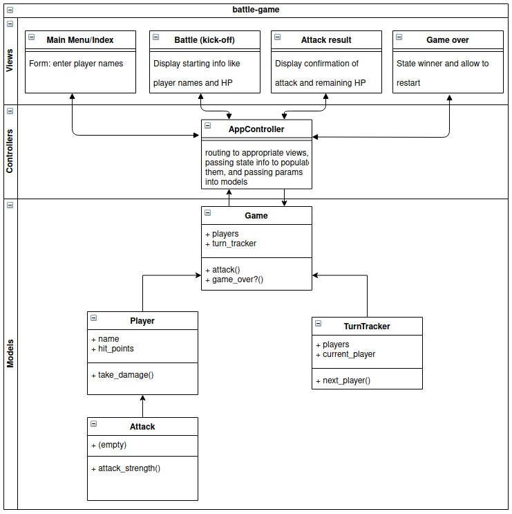

Battle App
--------

```
              ."-,.__
                 `.     `.  ,
              .--'  .._,'"-' `.
             .    .'         `'
             `.   /          ,'
               `  '--.   ,-"'
                `"`   |  \
                   -. \, |
                    `--Y.'      ___.
                         \     L._, \
               _.,        `.   <  <\                _
             ,' '           `, `.   | \            ( `
          ../, `.            `  |    .\`.           \ \_
         ,' ,..  .           _.,'    ||\l            )  '".
        , ,'   \           ,'.-.`-._,'  |           .  _._`.
      ,' /      \ \        `' ' `--/   | \          / /   ..\
    .'  /        \ .         |\__ - _ ,'` `        / /     `.`.
    |  '          ..         `-...-"  |  `-'      / /        . `.
    | /           |L__           |    |          / /          `. `.
   , /            .   .          |    |         / /             ` `
  / /          ,. ,`._ `-_       |    |  _   ,-' /               ` \
 / .           \"`_/. `-_ \_,.  ,'    +-' `-'  _,        ..,-.    \`.
  '         .-f    ,'   `    '.       \__.---'     _   .'   '     \ \
' /          `.'    l     .' /          \..      ,_|/   `.  ,'`     L`
|'      _.-""` `.    \ _,'  `            \ `.___`.'"`-.  , |   |    | \
||    ,'      `. `.   '       _,...._        `  |    `/ '  |   '     .|
||  ,'          `. ;.,.---' ,'       `.   `.. `-'  .-' /_ .'    ;_   ||
|| '              V      / /           `   | `   ,'   ,' '.    !  `. ||
||/            _,-------7 '              . |  `-'    l         /    `||
 |          ,' .-   ,' ||               | .-.        `.      .'     ||
 `'        ,'    `".'    |               |    `.        '. -.'       `'
          /      ,'      |               |,'    \-.._,.'/'
          .     /        .               .       \    .''
        .`.    |         `.             /         :_,'.'
          \ `...\   _     ,'-.        .'         /_.-'
           `-.__ `,  `'   .  _.>----''.  _  __  /
                .'        /"'          |  "'   '_
               /_|.-'\ ,".             '.'`__'-( \
                 / ,"'"\,'               `/  `-.|" 
```
credit: https://ascii.co.uk/art/pokemon

User stories
--------
```
As two Players,
So we can play a personalised game of Battle,
We want to Start a fight by entering our Names and seeing them

As Player 1,
So I can see how close I am to winning
I want to see Player 2's Hit Points

As Player 1,
So I can win a game of Battle,
I want to attack Player 2, and I want to get a confirmation

As Player 1,
So I can start to win a game of Battle,
I want my attack to reduce Player 2's HP by 10

As two Players,
So we can continue our game of Battle,
We want to switch turns

As Player 1,
So I can see how close I am to losing,
I want to see my own hit points

As Player 1,
So I can lose a game of Battle,
I want Player 2 to attack me, and I want to get a confirmation

As Player 1,
So I can start to lose a game of Battle,
I want Player 2's attack to reduce my HP by 10

As a Player,
So I can Lose a game of Battle,
I want to see a 'Lose' message if I reach 0HP first
```
Domain object model
----------

The concept for the structure to respond to the original user stories was as follows (the diagram itself is a sort of domain object model, but adapted to bring out the MVC structure):



Adding more graphics to the interface
---------

One of the interesting things for me about the project was that it was my first foray into using Ruby/Sinatra to interact with logic via browser input/output as opposed to the earlier Ruby command line apps I'd made at Makers Academy. 

For this reason, I continued developing that app past the point where the initial user stories (above) were complete. I followed Makers Academy stretch-goal suggestions (not in order) implementing the following:

```
As a Player,
So I can enjoy a game of Battle with more variety,
I want to choose from a range of attacks I could make

As a Player,
To introduce a degree of tactical judgment,
I want to attack options to vary in strength (both possible range and average)

As a Player,
So I can enjoy my game of Battle,
I want a sexy user interface
```

This last element - the interface - was based on a provided mock-up of how the app might look (provided by Makers). I considered making my own layout, but decided trying to implement to a specification would be more useful:


